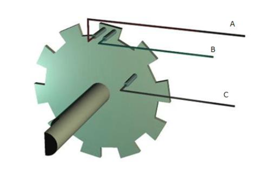
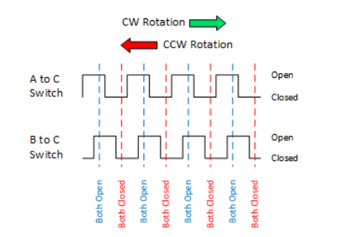
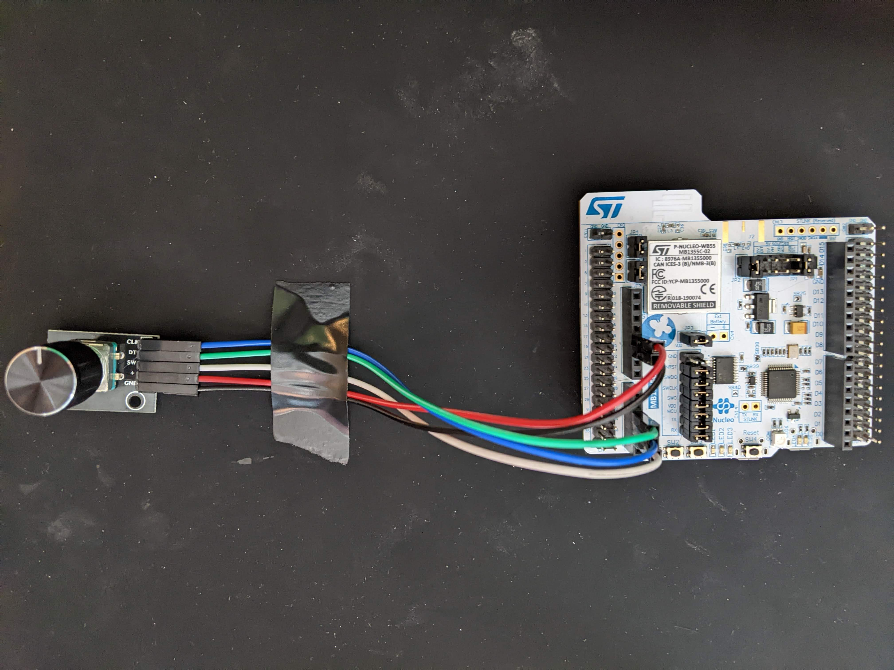
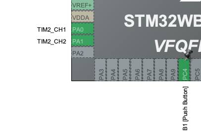
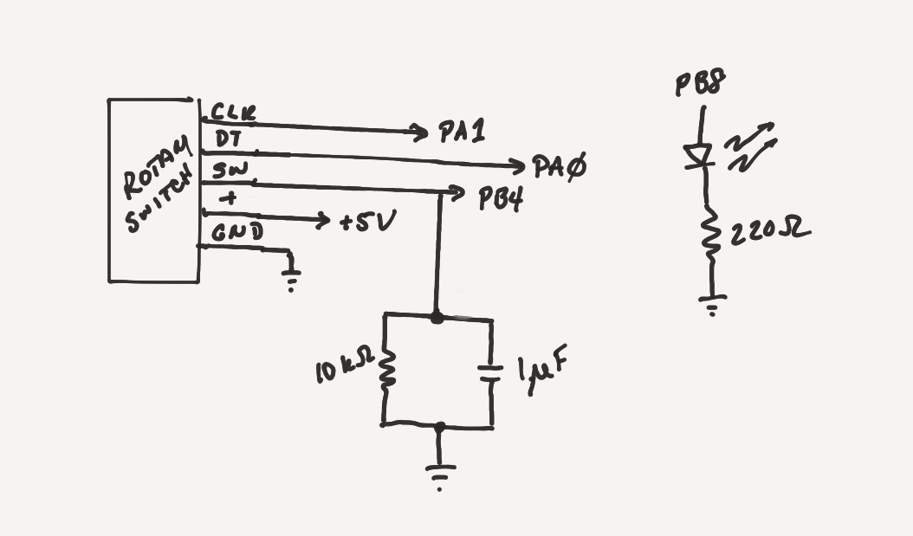
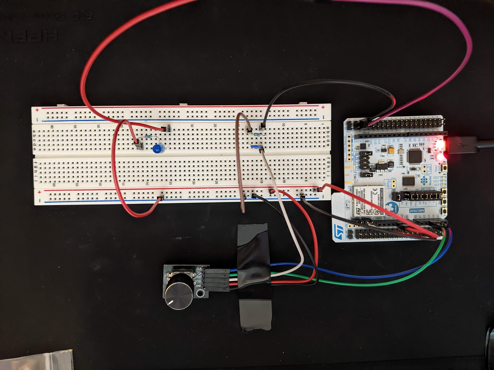

# Laboratory 8

In this lab, you will work with a rotary encoder switch.  The switch is a simple knob switch that can be turned either clockwise or counter-clockwise.  To start, you should read [this specification documentation](reference/KY-040%20Rotary%20Encoder.pdf).

Here is a illustration of how the switch is constructed:

   
*From Handson Technology KY-040 Data Spec*

The position of A and B is such that:

- Rotating the switch CW causes the switch between A and C to change states first,
- And, rotating the switch CCW causes the switch connecting B and C to change states first.

This rotation creates square waves that look like:



Given this, which terminal(s) are tied high (A, B, and/or C) and which terminal(s) are tied to ground (A, B, and/or C)?

Thus, understanding where in the transition you are tells you both direction of the rotation and the "switch", which you can keep count of.

## Experiment 1:  Interfacing The Rotary Switch To The TIM Encoder

### Parts List

- P-Nucleo-WB55 board
- Rotary Dial 
- Jumper Cables 

### Pinout Table

PIN | GPIO Setting | WB55 PIN | Connection
---- | ---- | ----| ----
PA0 | TIM2_CH1 | CN8 A2 | Rotary Dial - DT
PA1 | TIM2_CH2 | CN8 A3 | Rotary Dial - CLK
PC3 | GPIO_Input | CN8 A4 | Rotary Dial - SW
+5V | Vdc | CN6 5 | Rotary Dial - '+'
GND | GND | CN6 6 | Rotary Dial - GND



### Procedure

**Build Procedure**
1) Configure hardware according to above schematic and pinout
2) Set up a new STM32 project named `rotary_dial`
3) Under Pinout and Configuration, select Timers
4) Select TIM2 and configure the following options:  
    a) Under mode --> Combined Channels --> Select "Encoder Mode".   
    b) Under Parameter Settings, Counter Period --> 65535, auto-reload preload --> Enable, Encoder Mode --> TI1 and TI2, Input Filter --> 10.  
    c) You will see in the pinout view that PA0 and PA1 are now autopopulated for TIM2 CH1 and CH2:    
5) From Pinout and Configuration select Connectivity
6) Ensure your USART setting are set according to previous labs in order to send messages through the serial port
7) Set up GPIO Port C Pin 3 to be a GPIO_Input, pulled up
8) Under Project Manager --> Code Generator --> select all the checkboxes for "Generated Files" section
9) Save and generate code
10) Add the following code to your main.c
~~~
  /* Initialize all configured peripherals */
  MX_GPIO_Init();
  MX_USART1_UART_Init();
  MX_USB_PCD_Init();
  MX_TIM2_Init();
  /* USER CODE BEGIN 2 */
  HAL_TIM_Encoder_Start(&htim2, TIM_CHANNEL_ALL); //dont forget this or it will say nothing but 0 ad the encoder wont start....
  uint8_t MSG[50] = {'\0'};

  /* USER CODE END 2 */

  /* Infinite loop */
  /* USER CODE BEGIN WHILE */
  while (1)
  {
    /* USER CODE END WHILE */

    /* USER CODE BEGIN 3 */
      if(HAL_GPIO_ReadPin (GPIOC, GPIO_PIN_3))
      {
          sprintf(MSG, "Encoder Switch Released, Encoder Ticks = %u\n\r", ((TIM2->CNT)>>2));
          HAL_UART_Transmit(&huart1, MSG, sizeof(MSG), 100);
      }
      else
      {
          sprintf(MSG, "Encoder Switch Pressed,  Encoder Ticks = %u\n\r", ((TIM2->CNT)>>2));
          HAL_UART_Transmit(&huart1, MSG, sizeof(MSG), 100);
      }

  }
  /* USER CODE END 3 */
}
~~~
10) Build code and create a Debugger
11) Run code with the serial port connected to terminal interface
12) Turn the dial to see the rotary change values according to your encoder. 

> Note:  Take note of which way your dial turns to increase or decrease values for the dial. Notice in the code that the rotary button is in a natural "high" position.

**Using Scopy to view the dial output**
1) Properly connect ADALM2000 channels to ground
2) Connect Channels to CLK and DT inputs. 
3) Run code
4) As you turn the dial you will notice the two separate wave edges change distances. This is how the encoder reads the values of the dial. 

While you are debugging or running the code, turning the dial clockwise should cause the counter to count up.  Conversely, turning the dial counter-clockwise should cause the counter to count down.  When you press down on the dial (which is a SPST switch), you should see the text change from "released" to "pressed".

## Experiment 2:  Rotary Switch As Dimmer

You will now set up the switch to act as a dimmer for an LED.  To understand PWM, you might want to refer to [this page](https://www.codeinsideout.com/blog/stm32/timer/).  The whole page discusses HAL Timers (as opposed to the FreeRTOS timers we have used in previous labs).  

### Parts

- P-Nucleo-WB55 board
- Rotary Dial 
- 10k Resistor 
- 1uf Capicitor 
- Jumper Cables 
- LED light
- 220 ohm resistor 

### Schematic/Pinout



PIN | GPIO Setting | WB55 PIN | Connection
---- | ---- | ----| ----
PA0 | TIM2_CH1 ENCODER | CN8 A2 | Rotary Dial - DT
PA1 | TIM2_CH2 ENCODER | CN8 A3 | Rotary Dial - CLK
PB4 | GPIO_Input | CN10 4 | Rotary Dial - SW
+5V | Vdc | CN6 5 | Rotary Dial - '+'
GND | GND | CN6 6 | Rotary Dial - GND
PB8 | TIM16_CH1 PWM | CN10 3 | LED



### Procedure

1) Configure hardware according to above schematic and pinout
2) Set up a new STM32 project named `led_dimmer`
3) Configure your project for TIM2, USART, and the PB4 as a GPIO_Input for the SW (note that the GPIO Port and Pin are DIFFERENT for this experiment from the last experiment). TIM2 is an encoder like the last experiment and USART is a Serial port like the last experiment.
4) Select TIM16 and configure the following options:  
    a) Under mode --> Channel 1 --> Select "PWM Generation Channel 1".   
    b) Under Parameter Settings, Counter Period --> 65535, auto-reload preload --> Enable.  
    c) Make sure that PWM Generation Channel 1 --> Mode is set to "PWM mode 1"  
    d) You will see in the pinout view that PB8 are now autopopulated for TIM16_CH1.   
5) Under Project Manager --> Code Generator --> select all the checkboxes for "Generated Files" 
6) Save and generate code.
7) In this experiment, you will modify your code so that you start the encoder and the PWM timers.
```
/* USER CODE BEGIN 2 */
  HAL_TIM_Encoder_Start(&htim2, TIM_CHANNEL_ALL); //added to start encoder
  HAL_TIM_PWM_Start(&htim16, TIM_CHANNEL_1); //added to start PWM output
```
8) Design code that turns up or down the brightness of the LED based on the rotary switch rotation.  The LED should start at the lowest brightness (duty cycle of 0%).  If the rotary switch button (SW) is pressed, then the LED is reset to a duty cycle of 0%.  If the dial is turned CW, this corresponds to "up", which should cause the LED to get brighter.  If the dial is turned CCW, this corresponds to "down", which should cause the LED to get dimmer.  Do not let the TIM2 encoder "wrap around".  That is, if the LED gets to 0% duty cycle, it should stay there until the dial is turned CW (no matter how much the user keeps turning the dial CCW).  Likewise, if the LED gets to full brightness, it should stay at full brightness until the dial is turned CCW (no matter how much the user keeps turning the dial CW).

You might choose to use the oscilloscope to make sure your PWM output is working properly.  You can also set the TIM2 encoder count and TIM16 duty cycle value directly using
```
		TIM2->CNT = 0;
		TIM16->CCR1 = 0;
```

This, of course, resets the counter to zero and sets the CCR1 duty cycle register to zero.

> NOTE 1:  For my version of STM32CubeIDE, I have to include `#include "usb.h"` at the top of `main.c`.  For whatever reason, the automatic code generation doesn't do it.  Not including it doesn't mess up the project, but it will generate one or more warnings during build.

> NOTE 2:  If you take each and every count of the encoder to increase the duty cycle from 0 to 65535, it will take *forever* for you to get to 100% duty cycle.  So, you might choose to restrict the encoder output to values between 0 and 127.  There is more than one way to do this.  From there, you can scale (or bit shift or whatever) to get between 0 and 65335 for the PWM generator.

> NOTE 3:  Include a o-scope plot of your PWM wave (at some duty cycle that illustrates the wave) in your report.
