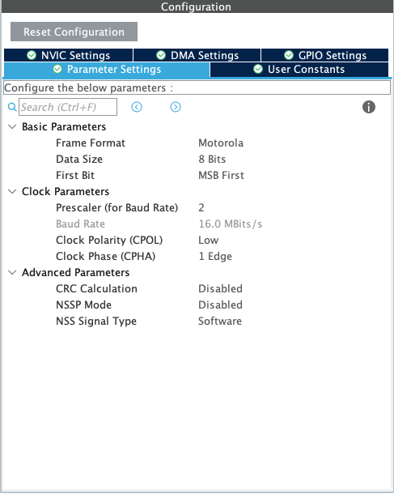
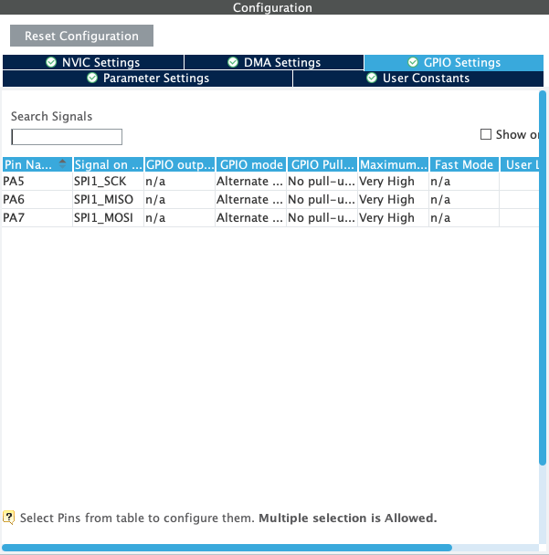
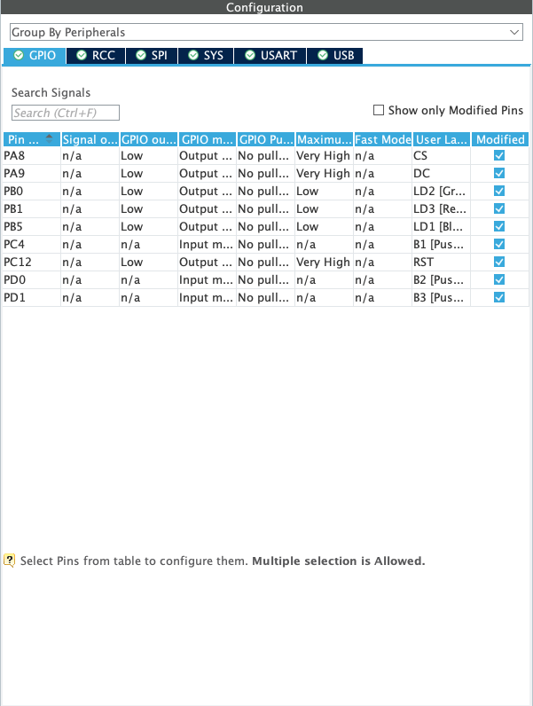
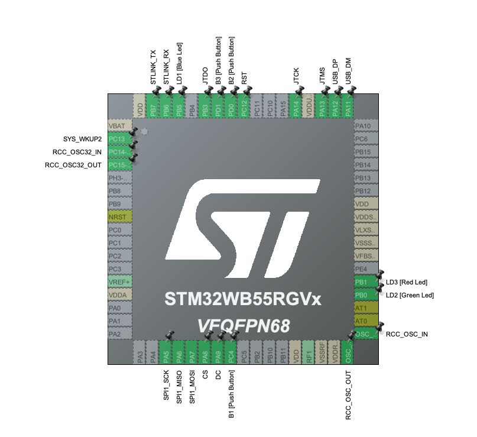
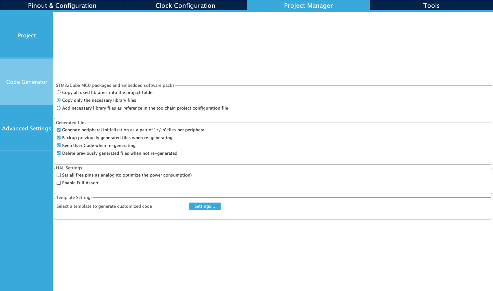

# Laboratory 7

In this laboratory, you will interface an LCD display to the NUCLEO-WB55 board.  Typically, this is a tricky process, requiring a lot of support code.  However, the ILI9341 breakboard that the LCD display is tied to makes it fairly easy.  An interesting tutorial to the ILI9341 can be found [here](https://ece353.engr.wisc.edu/external-devices/ili9341/).  The specification for the board can be found [here](https://cdn-shop.adafruit.com/datasheets/ILI9341.pdf).

In this lab, you will need:

- NUCLEO-WB55 development board
- ILI9341 LCD Board + Display
- Jumper wires

The first part of the lab will walk you through how to do a "Hello World" with the display.  In the second part, you will study the display driver and then attempt some text and graphics of your own.

## Experiment 1:  LCD Hello World

In this experiment, you will wire the LCD to the NUCLEO board and then interface the ILI9341 to the WB55.  Much of this is "cookbook".  Let's get started.

First, put the ILI9341 on the breadboard.  You only care about the `GND`, `Vin`, `CLK`, `MISO`, `MOSI`, `CS`, `D/C`, and `RST` lines on the display.  You should have pre-soldered pins on that side of the board.  Place your display so that you can easily access those pins.  It should look something like:


Now, wire up the board to the display using the following pinout:

| LCD Pin | WB55 Label | WB55 Pin | SPI/GPIO |
| ------- | ---------- | -------- | ---- |
| GND     | GND        | CN10 Pin 9 | N/A |
| Vin     | Vdd        | CN10 Pin 7 | N/A |
| CLK     | SPI1_SCK   | CN10 Pin 11| PA5 |
| MISO    | SPI1_MISO  | CN10 Pin 13| PA6 |
| MOSI    | SPI1_MOSI  | CN10 Pin 15| PA7 |
| CS      | GPIO       | CN10 Pin 25| PA8 |
| D/C     | GPIO       | CN10 Pin 19| PA9 |
| RST     | GPIO       | CN10 Pin 21| PC12|

Now we'll set up the project.  Open up STM32CubeIDE, set the workspace to your repo for this Lab, and open a new project.  The project should be called `lcd_display`.  Set up the project for our NUCLEO board and have it configure for default peripherals.

First, go to `PA5` in the *Pinout View* and set it to `SPI1_SCK`.

Then go to to the *Categories* tab in the *Pinout & Configuration* screen.  In *Categories*, click on *Connectivity* and look for *SPI1*.  Enable *SPI1* for "Full-Duplex Master" and disable the Hardware NSS Signal.  In Parameter Settings, make sure it is 8 bits data size, Motorola Frame Format, and the First Bit is MSB First.

Your configuration should look like:



Click on the *GPIO Settings* tab under *Configuration*.  The GPIO pins should be set to GPIO mode "Alternate Function Push Pull", GPIO Pull-up/Pull-down to "No pull-up and no pull-down" and the Maximum output speed to "Very high".



Now, go to the *System Core* section under *Categories* and click on *GPIO*.  The typical `LD2`, `LD3`, `LD1`, `B2`, and `B3` are already configured.  Set up three more lines:  `PA8` for CS, `PA9` for D/C, and `PC12` for RST.  You will name the lines `CS`, `DC`, and `RST`.  They will be GPIO outputs with no pull up or pull down and all set to "Very High" maximum speed.  Your configuration should look like:



Your final Pinout view should look like:



Finally, go to the *Project Manager* tab in the IOC view and select *Code Generator* on the left side.  Make sure all four of the check boxes under "Generated Files" are selected:



Save the project and generate code.  After the code generation, make sure that there are separate files for `gpio.c`, `spi.c', `main.c`, `usart.c`, `usb.c`.  If there are not, go back and try again.

Now, copy the files `ILI9341_GFX.c` and `ILI9341_STM32_Driver.c` to the `Src` directory of your project.  Do the same for `5x5_font.h`, `ILI9341_GFX.h` and `ILI9341_STM32_Driver.h` but put those in the `Inc` directory.  You will find these files in the `ILI9341` directory in this assignment repo.

Finally, open the `main.c` function.  Make sure to include the driver `.h` files:

```
/* USER CODE END Header */
/* Includes ------------------------------------------------------------------*/
#include "main.h"
#include "spi.h"
#include "usart.h"
#include "gpio.h"
#include "usb.h"

/* Private includes ----------------------------------------------------------*/
/* USER CODE BEGIN Includes */
#include "ILI9341_STM32_Driver.h"
#include "ILI9341_GFX.h"

/* USER CODE END Includes */
```

> NOTE:  For whatever reason, I had to add the `#include "usb.h"` to the main function.  I'm not sure why it wasn't automagically included, but on my version, it wasn't and without it, you get some distracting warnings.

Now, in the main function, you should modify to look like:

```
/**
  * @brief  The application entry point.
  * @retval int
  */
int main(void)
{
  /* USER CODE BEGIN 1 */

  /* USER CODE END 1 */

  /* MCU Configuration--------------------------------------------------------*/

  /* Reset of all peripherals, Initializes the Flash interface and the Systick. */
  HAL_Init();

  /* USER CODE BEGIN Init */

  /* USER CODE END Init */

  /* Configure the system clock */
  SystemClock_Config();

/* Configure the peripherals common clocks */
  PeriphCommonClock_Config();

  /* USER CODE BEGIN SysInit */

  /* USER CODE END SysInit */

  /* Initialize all configured peripherals */
  MX_GPIO_Init();
  MX_USART1_UART_Init();
  MX_USB_PCD_Init();
  MX_SPI1_Init();

  /* USER CODE BEGIN 2 */
  ILI9341_Init(); // Initialize LCD driver
  /* USER CODE END 2 */

  /* Infinite loop */
  /* USER CODE BEGIN WHILE */
  while (1)
  {
    /* USER CODE END WHILE */

    /* USER CODE BEGIN 3 */
	    HAL_Delay(2000);
		ILI9341_Fill_Screen(MAROON);
		ILI9341_Set_Rotation(SCREEN_VERTICAL_1);
		ILI9341_Draw_Text("Hello World!", 10, 10, WHITE, 1, MAROON);
		HAL_Delay(2000);
		ILI9341_Fill_Screen(WHITE);

  }
  /* USER CODE END 3 */
}
```

This code will initialize the ILI9341, then fill the screen with a maroon colored background and write the words "Hello World!".  The screen will blank to white, then draw the screen all over again.

If your screen look like this:


## Experiment 2:  ASCII Art

Study the ILI9341 driver.  Carefully understand how it works.  Using the driver code, draw the following ASCII art on the LCD display:

```
                       .,,uod8B8bou,,.
              ..,uod8BBBBBBBBBBBBBBBBRPFT?l!i:.
         ,=m8BBBBBBBBBBBBBBBRPFT?!||||||||||||||
         !...:!TVBBBRPFT||||||||||!!^^""'   ||||
         !.......:!?|||||!!^^""'            ||||
         !.........||||                     ||||
         !.........||||  ##                 ||||
         !.........||||                     ||||
         !.........||||                     ||||
         !.........||||                     ||||
         !.........||||                     ||||
         `.........||||                    ,||||
          .;.......||||               _.-!!|||||
   .,uodWBBBBb.....||||       _.-!!|||||||||!:'
!YBBBBBBBBBBBBBBb..!|||:..-!!|||||||!iof68BBBBBb....
!..YBBBBBBBBBBBBBBb!!||||||||!iof68BBBBBBRPFT?!::   `.
!....YBBBBBBBBBBBBBBbaaitf68BBBBBBRPFT?!:::::::::     `.
!......YBBBBBBBBBBBBBBBBBBBRPFT?!::::::;:!^"`;:::       `.
!........YBBBBBBBBBBRPFT?!::::::::::^''...::::::;         iBBbo.
`..........YBRPFT?!::::::::::::::::::::::::;iof68bo.      WBBBBbo.
  `..........:::::::::::::::::::::::;iof688888888888b.     `YBBBP^'
    `........::::::::::::::::;iof688888888888888888888b.     `
      `......:::::::::;iof688888888888888888888888888888b.
        `....:::;iof688888888888888888888888888888888899fT!
          `..::!8888888888888888888888888888888899fT|!^"'
            `' !!988888888888888888888888899fT|!^"'
                `!!8888888888888888899fT|!^"'
                  `!988888888899fT|!^"'
                    `!9899fT|!^"'
                      `!^"'
```

Call this project `ascii_art` in your workspace.  With the screen in the vertical orientation, you should be able to fit this graphic onto the screen in toto.

## Experiment 3:  Tic-Tac-Toe Board

Create a project called `tic-tac-toe` in your workspace.  Using the ILI9341 and the provided driver, draw a tic-tac-toe board on the LCD display.  The background should be yellow and the lines should be navy blue.

## Lab Report

For your lab report, include a photo or video of Experiment 1.  There is no need to write anything else for Experiment 1.  You should write the usual report format for Experiments 2 and 3.
